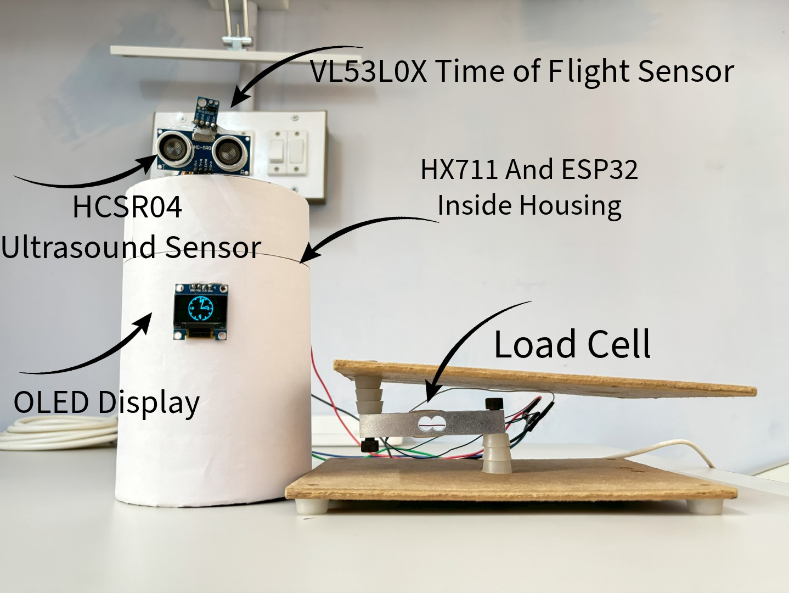
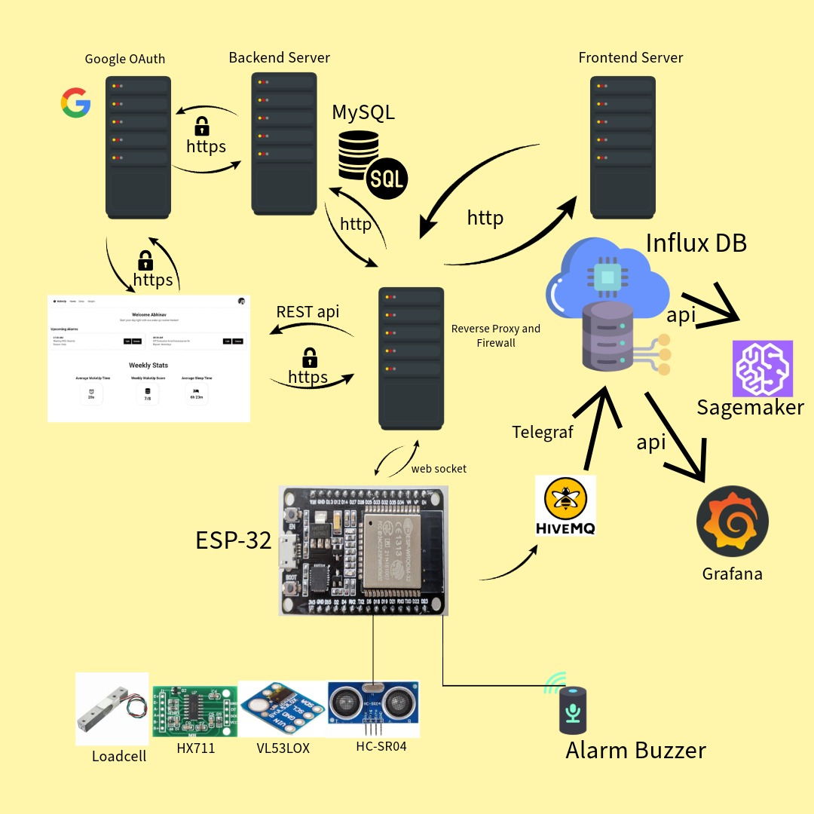
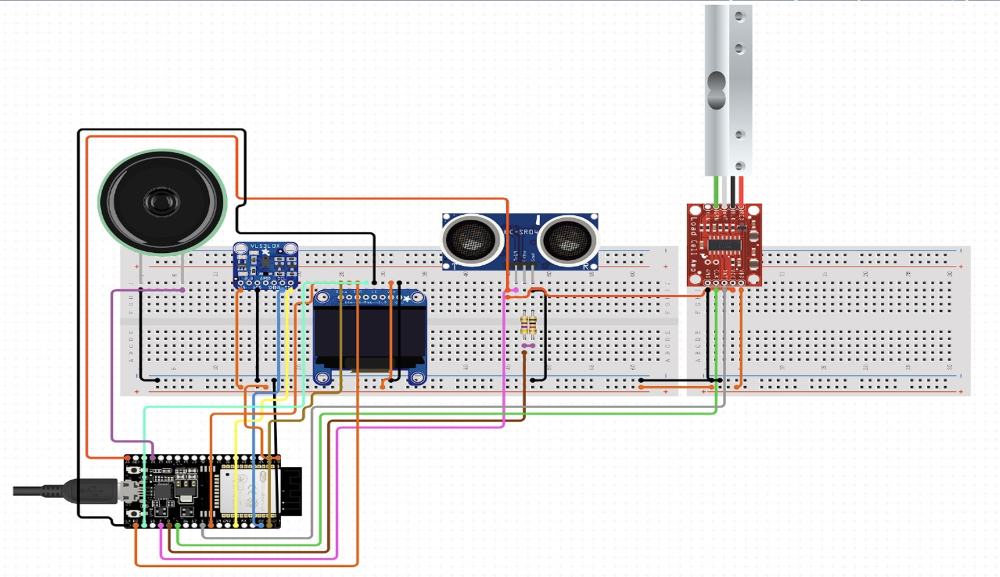

# WakeUp IOT Smart Alarm, Weight and Sleep Monitoring

    

 

A cloud based smart alarm clock using IoT sensors. This system aims to integrate various hardware and software components to provide an efficient and user-friendly alarm clock that leverages cloud connectivity for enhanced functionality. The main goals were to improve user experience, enable advanced features like smart weight tracking and provide valuable insights into sleep patterns.

## Demonstration
- This alarm system is designed to help you stay on top of your meetings.
- You input all your meetings into the app, and the hardware detects if you're still in bed before a meeting starts.
- If you're in bed 5 minutes before a scheduled meeting, the alarm will ring continuously until you get up.
- The alarm detects your presence by measuring an increase in weight through a load cell and a decrease in distance using a TOF and ultrasound sensor.

https://github.com/user-attachments/assets/0b9d8c76-09d8-47bc-ae6c-5a132773f79e

For Demonstration purposes, A 20kg loadcell was used only for the head. However for the actual Project a combination of 4 20 kg load cells were placed under the bed to weigh the whole body.

## UI Screens
https://github.com/user-attachments/assets/1fc1a6ed-43d6-4194-8b75-5fb851d9eb4a

## Data Flow

    

1. `ESP32` Microcontroller connects to WebApplication Server `websocket`, gets alarm data in realTime
2. During NightTime, User Weight and Movement data from TOF, Ultrasound and HX711 Weight Sensors are sent to `InfluxDB` via `Telegraf`, `HiveMQ`.
3. Live real time monitoring of data and database data are available through the cloud `Grafana` dashboard
4. Data from `InfluxDB` is read by `AWS Sage Maker` for model based data Analytics using Machine Learning Models
5. All User Alarms and Aggregated Statistics are stored in `MYSQL Database` in `Azure`.
6. NextJS Frontend Server and NodeJS(ExpressJS) Backend Server are passed through a reverse proxy for user Abstraction and Security.
7. `Google OAuth 2.0` with `JSON Web Token` is implemented for authenticating users.

https://github.com/user-attachments/assets/c124c573-dad5-4181-9e5f-c7c184a81f08

## IOT System Design

    

## Circuit Diagram

    

## Analytics

https://github.com/user-attachments/assets/05f6a328-7e01-4265-a6ba-704ec8b60719

## Libraries needed for ESP32 main.ino file

| Name | URL |
| --- | --- |
| Websocket | https://github.com/gilmaimon/ArduinoWebsockets?tab=readme-ov-file |
| WiFi | https://github.com/esp8266/Arduino/tree/master/libraries/ESP8266WiFi/src |
| WiFiClientSecure | https://github.com/esp8266/Arduino/blob/master/libraries/ESP8266WiFi/src/WiFiClientSecure.h |
| MQTT | https://github.com/adafruit/Adafruit_MQTT_Library |
| Adafruit_VL53L0X | https://github.com/adafruit/Adafruit_VL53L0X |
| ArduinoHTTPClient | https://github.com/arduino-libraries/ArduinoHttpClient |
| HX711 | https://github.com/bogde/HX711 |
| Adafruit_SSD1306 | https://github.com/adafruit/Adafruit_SSD1306 |
| NTPClient | https://github.com/arduino-libraries/NTPClient |
| Time | http://playground.arduino.cc/Code/Time/ |
| Adafruit_GFX | https://github.com/adafruit/Adafruit-GFX-Library |

